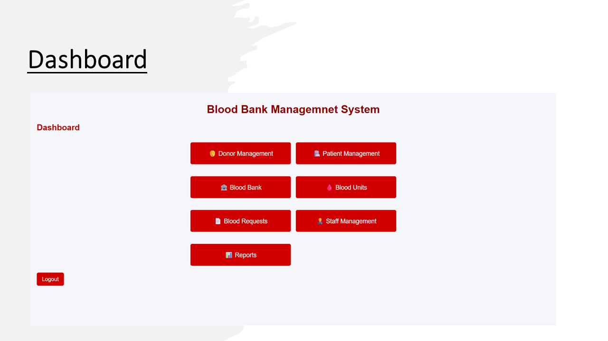
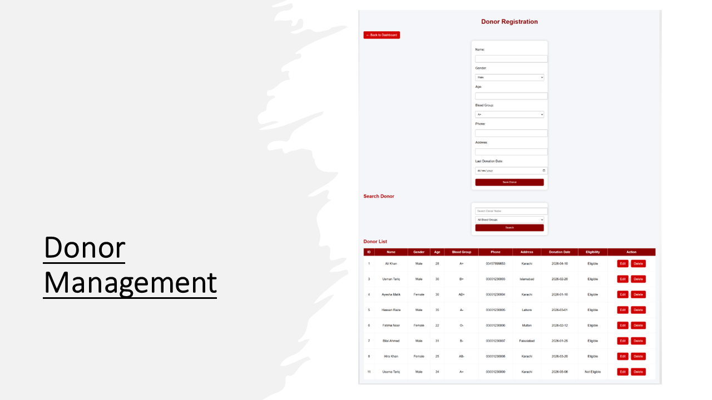
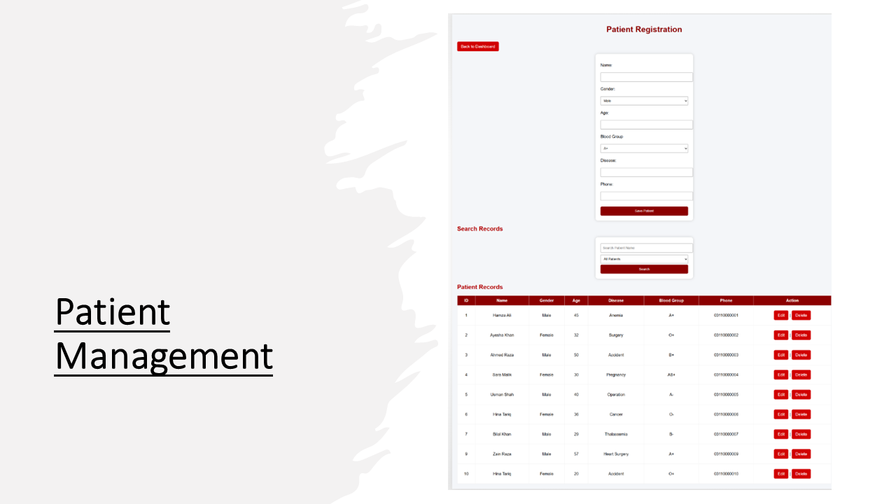
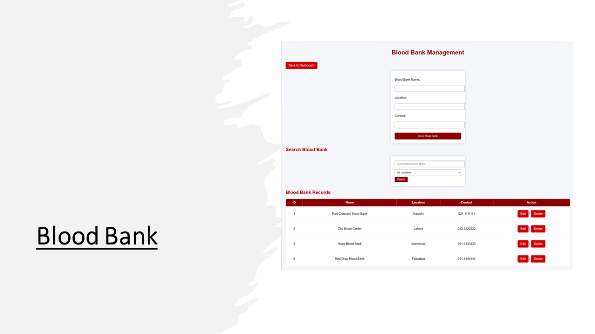
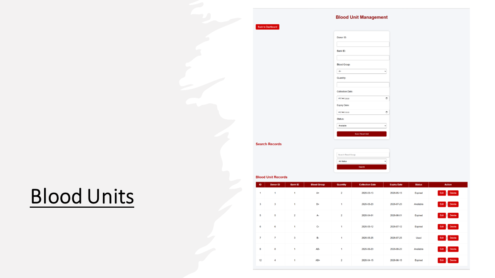
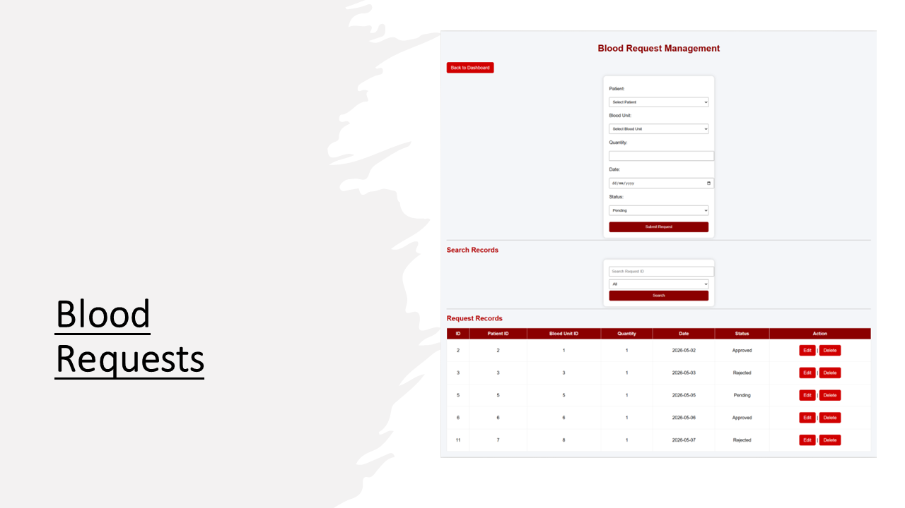
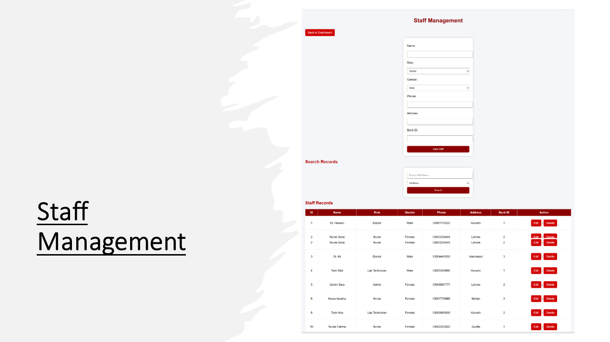
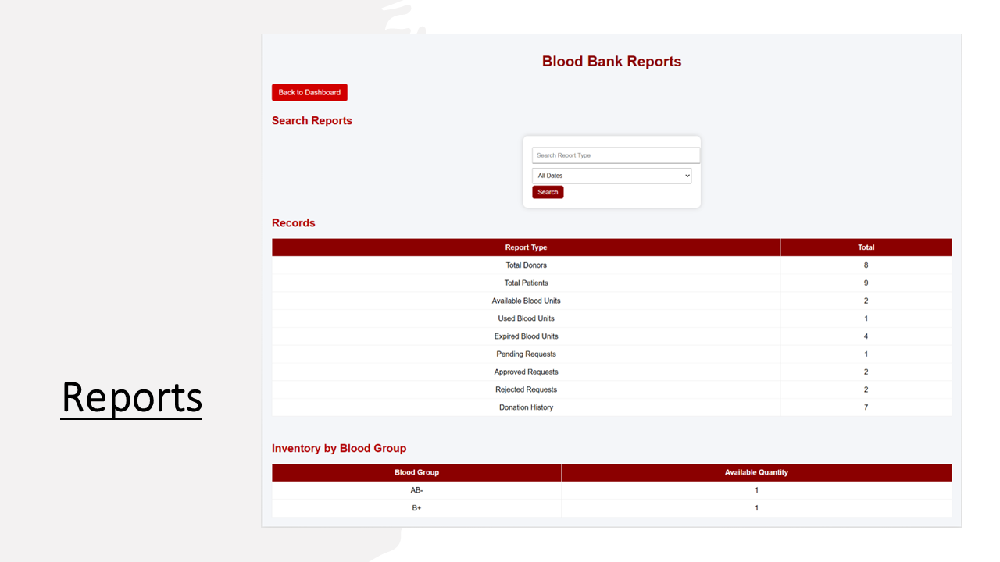

# 🩸 Blood Bank Management System


A web-based **Blood Bank Management System** developed using **HTML, CSS, PHP, and MySQL**. This project is designed to simplify and manage blood bank operations 
by maintaining donor records, patient information, blood inventory, blood requests, staff details, and reports in one centralized system.

---

## 📌 Features

- 👤 Donor Management
  - Add, Update, Delete, and View Donor Records

- 🏥 Patient Management
  - Register and Manage Patient Information

- 🩸 Blood Inventory Management
  - Maintain Blood Groups and Available Units

- 📋 Blood Request Management
  - Process and Track Blood Requests

- 👨‍💼 Staff Management
  - Add and Manage Staff Records

- 📊 Reports
  - View Blood Stock and System Records

---

## 🛠️ Technologies Used

- HTML5
- CSS3
- PHP
- MySQL
- XAMPP
- phpMyAdmin

---

## 📂 Project Structure

```
bloodbank/
│── index.php
│── donor.php
│── patient.php
│── bloodbank.php
│── bloodunit.php
│── request.php
│── staff.php
│── reports.php
│── style.css
│── database.sql
└── assets/
```

---

## ⚙️ Installation

1. Clone this repository:

```bash
git clone https://github.com/hania-sajjad1/Blood-Bank-Management-System.git
```

2. Copy the project folder into the **htdocs** directory of XAMPP.

3. Start **Apache** and **MySQL** using XAMPP.

4. Import the `database.sql` file into **phpMyAdmin**.

5. Open your browser and visit:

```
http://localhost/bloodbank/
```

---

## 🎯 Learning Outcomes

This project helped me gain practical experience in:

- Frontend Development
- Backend Development with PHP
- Database Design
- CRUD Operations
- SQL Queries
- Relational Database Management
- Full-Stack Web Development Fundamentals

---

## 📷 Project Screenshots

### 📊 Dashboard

The dashboard serves as the central hub of the system, providing quick access to all modules and displaying an organized interface for managing blood bank operations.



---

### 👤 Donor Management

This module allows users to add, update, view, and delete donor records while maintaining complete donor information.



---

### 🏥 Patient Management

The patient management module stores patient details and helps manage patient records efficiently.



---

### 🩸 Blood Bank Management

This section manages blood bank information and maintains the overall blood bank records.



---

### 🧪 Blood Units

The blood units module keeps track of available blood groups and their quantities in the inventory.



---

### 📋 Blood Requests

This module manages blood requests, allowing users to record and process requests efficiently.



---

### 👨‍💼 Staff Management

The staff management module is used to maintain staff information, including adding, updating, and viewing staff records.



---

### 📈 Reports

The reports module provides an overview of blood inventory and other important system records for better decision-making.



---

## 🚀 Future Improvements

- User authentication and role-based access
- Email notifications
- Blood request approval workflow
- Search and filtering
- Responsive mobile interface

---

## 👩‍💻 Author

**Hania Sajjad**

Computer Engineering Student

---

⭐ If you found this project helpful, feel free to star this repository.
